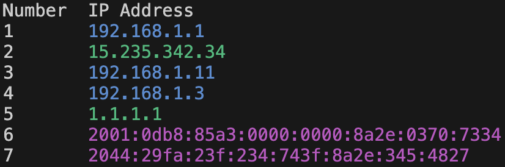

# Tcpdump ip extract

Parse IP addresses from a tcpdump file

## Usage

```bash
usage: tcpdump_ip_extract [-h] -f FILE [-c] [-n] [-d]

Parse IP addresses from a tcpdump file

options:
  -h, --help            show this help message and exit
  -f FILE, --file FILE  File to parse
  -c, --no-color        Disable color output
  -n, --number          Number output
  -d, --duplicate       Show duplicate IPs
```

## Example

Here is a example with `-n`



## License 

This project is licensed under the GNU General Public License v3.0 - see the [LICENSE](LICENSE) file for details